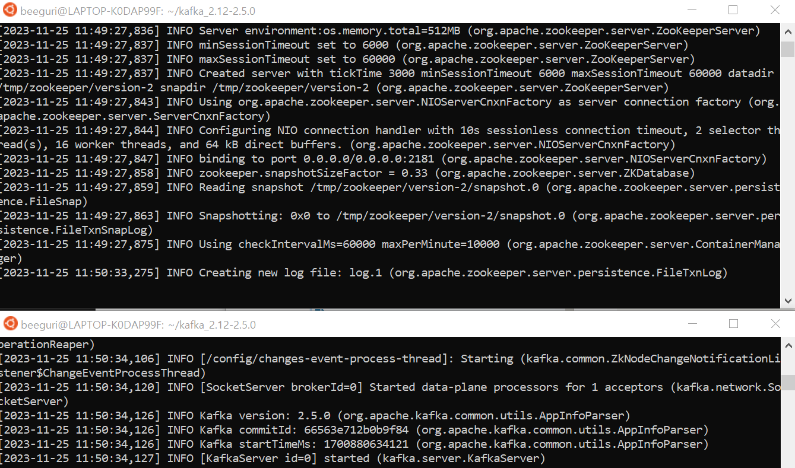

아파치 카프카 애플리케이션 프로그래밍을 공부 합니다!
- 관련강의 : [[아파치 카프카 애플리케이션 프로그래밍] 개념부터 컨슈머, 프로듀서, 커넥트, 스트림즈까지!](https://inf.run/uCwV5)

# 목차
### [1. kafka 실행](#kafka-실행)
### [1-1. kafka 실행: window ver.](#kafka-실행-window-ver)
### [2. kafka shell script](#kafka-shell-script)
### [3. 프로듀서 애플리케이션 개발](#프로듀서-애플리케이션-개발)
### [4. 컨슈머 애플리케이션 개발](#컨슈머-애플리케이션-개발)
---

# kafka 실행
### ✅ 실행 환경 : Ubuntu 20.04.3 LTS
### ✅ 자바 설치
```bash
$ sudo apt-get update
$ sudo apt-get install openjdk-11-jdk
```
### ✅ Kafka 다운로드 `ver.2.5.0`
```bash
# 다운로드
$ wget https://archive.apache.org/dist/kafka/2.5.0/kafka_2.12-2.5.0.tgz

# 압축해제
$ tar -xvzf kafka_2.12-2.5.0.tgz

# 확인
$ ls ~/kafka_2.12-2.5.0
LICENSE  NOTICE  bin  config  libs  site-docs

# 브로커에서 적재한 데이터 확인을 위한 폴더 생성
$ cd kafka_2.12-2.5.0/
$ mkdir data
$ ls
LICENSE  NOTICE  bin  config  data  libs  site-docs
```
    
### ✅ server.properties 수정
```bash
$ vi config/server.properties

# 수정된거 확인
$ cat config/server.properties| grep log.dirs
```

### ✅ Zookeeper 실행
```bash
$ bin/zookeeper-server-start.sh config/zookeeper.properties

```

### ✅ Kafka broker 실행
```bash
$ bin/kafka-server-start.sh config/server.properties
```

### ✅ 실행 확인


```bash
# 브로커 확인
$ bin/kafka-broker-api-versions.sh --bootstrap-server localhost:9092
localhost:9092 (id: 0 rack: null) -> (
        Produce(0): 0 to 8 [usable: 8],
        Fetch(1): 0 to 11 [usable: 11],
        ListOffsets(2): 0 to 5 [usable: 5],
        Metadata(3): 0 to 9 [usable: 9],
...

# 토픽 확인
$ bin/kafka-topics.sh --bootstrap-server localhost:9092 --list
```

### ✅ 참고
```bash
# host에 local 추가해서 추후 편리하게 이용할 수 있도록
$ sudo vi /etc/hosts

127.0.0.1 my-kafka # <<추가!
```

# kafka 실행 (window ver.)
### ✅ 실행 환경 : Window PowerShell 7
### ✅ [Kafka 다운로드 `ver.2.5.0`](https://kafka.apache.org/downloads)
- trg 파일 압축 해제
### ✅ server.properties 수정
```bash
> kafka_2.12-2.5.0\config\server.properties

listeners=PLAINTEXT://localhost:9092
advertised.listeners=PLAINTEXT://localhost:9092

```

### ✅ Zookeeper 실행
```bash
$ .\bin\windows\kafka-console-consumer.bat --bootstrap-server localhost:9092

```

### ✅ Kafka broker 실행
```bash
$ .\bin\windows\kafka-server-start.bat .\config\server.properties
```

### ✅ 실행 확인
```bash
$ .\bin\windows\kafka-console-consumer.bat --bootstrap-server localhost:9092 --topic test --from-beginning

testMessage
hello
```

# kafka shell script
### ✅ kafka-topics.sh
- 토픽을 생성할 때는 커맨드라인툴을 이용하여 명시적으로 생성하기!
```bash
# 기본
$ bin/kafka-topics.sh --create --bootstrap-server my-kafka:9092 --topic hello.kafka

# 옵션 추가해서 만들기
$ bin/kafka-topics.sh --create --bootstrap-server my-kafka:9092 --partitions 10 --replication-factor 1 --topic hello.kafka2 --config retention.ms=172800000

# 확인
$ bin/kafka-topics.sh --bootstrap-server my-kafka:9092 --topic hello.kafka --describe
Topic: hello.kafka      PartitionCount: 1       ReplicationFactor: 1    Configs: segment.bytes=1073741824
        Topic: hello.kafka      Partition: 0    Leader: 0       Replicas: 0     Isr: 0

$ bin/kafka-topics.sh --bootstrap-server my-kafka:9092 --topic hello.kafka2 --describe
Topic: hello.kafka2     PartitionCount: 10      ReplicationFactor: 1    Configs: segment.bytes=1073741824,retention.ms=172800000
        Topic: hello.kafka2     Partition: 0    Leader: 0       Replicas: 0     Isr: 0
        Topic: hello.kafka2     Partition: 1    Leader: 0       Replicas: 0     Isr: 0
        Topic: hello.kafka2     Partition: 2    Leader: 0       Replicas: 0     Isr: 0
        Topic: hello.kafka2     Partition: 3    Leader: 0       Replicas: 0     Isr: 0
        Topic: hello.kafka2     Partition: 4    Leader: 0       Replicas: 0     Isr: 0
...

# 파티션 늘리기
$ bin/kafka-topics.sh --bootstrap-server my-kafka:9092 --topic test --alter --partitions 5

# 파티션 줄이기는 불가
```

### ✅ kafka-configs.sh
- min.insync.replicas : 워터마크 등 안전하게 데이터를 보낼 때 설정
- 브로커에 설정 된 각종 기본값을 조회 할 수 있음 (--broker, --all, --describe)
```bash
$ bin/kafka-configs.sh --bootstrap-server my-kafka:9092 --alter --add-config min.insync.replicas=2 --topic test
```

### ✅ kafka-console-producer.sh
- 카프카의 데이터를 테스트 용도로 넣을 때 사용
- 키를 별도로 입력하지 않을 때는 `null`로 설정 됨.
- 키를 사용하기 위해서는 `key.separator`를 선언해야 함
```bash
# key 없을 때
$ bin/kafka-console-producer.sh --bootstrap-server my-kafka:9092 --topic hello.kafka
>hello
>kafka
>0
>1
>2

# key 추가
$ bin/kafka-console-producer.sh --bootstrap-server my-kafka:9092 --topic hello.kafka --property "parse.key=true" --property "key.separator=:"
>k1:v1
>k2:v2
```

### ✅ kafka-console-consumer.sh
- 특정 토픽에 있는 데이터를 consume해서 조회
```bash
# 값만 조회
$ bin/kafka-console-consumer.sh --bootstrap-server my-kafka:9092 --topic hello.kafka hello.kafka --from-beginning
hello
kafka
0
1
2
3
4
5
6
v1
v2

# key와 함께 조회
$ bin/kafka-console-consumer.sh --bootstrap-server my-kafka:9092 --topic hello.kafka --property print.key=true --property key.separator="-" --from-beginning
null-hello
null-kafka
null-0
null-1
null-2
null-3
null-4
null-5
null-6
k1-v1
k2-v2

# consume 개수 조절
--max-massages 10

# 특정 파티션 조회
--partition 2
```
- `--group`
  - 컨슈머 그룹을 기반으로 console-consumer가 동작
  - 어느 레코드까지 읽었는지(오프셋에 대한 커밋 데이터)가 카프카 브로커에 저장 됨
  - 커밋 데이터는 consumer.offset에 저장
```bash
$ bin/kafka-console-consumer.sh --bootstrap-server my-kafka:9092 --topic hello.kafka --group hello-group --from-beginning

# 확인
$ bin/kafka-topics.sh --bootstrap-server my-kafka:9092 --list
__consumer_offsets
hello.kafka
hello.kafka2
test
```
- produce 한 메시지를 consumer가 확인


### ✅ kafka-consumer-groups.sh
- 해당 컨슈머 그룹이 어떤 토픽을 대상으로 레코드를 가져갔는 지 상태를 확인
- 파티션 번호, 현재까지 가져간 레코드의 오프셋, 파티션 마지막 레코드의 오프셋, 컨슈머 랙, ... 조회 할 수 있음
- `컨슈머 랙` : 프로듀서가 데이터를 보낸 양에 비해 컨슈머가 데이터를 처리하는 데 지연이 발생하는 정도를 확인 할 수 있음.
```bash
$ bin/kafka-consumer-groups.sh --bootstrap-server my-kafka:9092 --group hello-group --describe

Consumer group 'hello-group' has no active members.

GROUP           TOPIC           PARTITION  CURRENT-OFFSET  LOG-END-OFFSET  LAG             CONSUMER-ID     HOST            CLIENT-ID
hello-group     hello.kafka     0          11              11              0               -               -               -

# 프로듀서가 데이터를 추가하고 나서 다시 확인
# LAG으로 5개의 지연이 있음을 확인할 수 있음
$ bin/kafka-consumer-groups.sh --bootstrap-server my-kafka:9092 --group hello-group --describe

Consumer group 'hello-group' has no active members.

GROUP           TOPIC           PARTITION  CURRENT-OFFSET  LOG-END-OFFSET  LAG             CONSUMER-ID     HOST            CLIENT-ID
hello-group     hello.kafka     0          11              16              5               -               -            
```
- `reset-offsets` : 데이터를 어디부터 다시 읽을 지 정할 수 있음

### ✅ 기타 쉘 스크립트
- kafka-producer-perf-test.sh, kafka-consumer-perf-test.sh
  - 퍼포먼스 측정
  - 카프카 브로커와 컨슈머 간의 네트워크 체크
- kafka-reassign-partitions.sh
  - 리더 파티션과 팔로 파티션을 적당히 분산해서 사용하기 위함
  - 리더 파티션을 자동 리밸런싱
- kafka-delete-record.sh
  - 이전 데이터부터 지정한 오프셋까지의 레코드를 모두 삭제
- kafka-dump-log.sh
  - 카프카 운영 시 세그먼트 로그 확인


# 프로듀서 애플리케이션 개발
### ✅ 프로듀서

- 리더 파티션을 가지고 있는 카프카 브로커와 직접 통신
- ProducerRecord : 토픽, 파티션, 타임스탬프, 메시지키, 메시지 값을 가짐
- Partitioner : 어느 파티션으로 전송할 지 지정하는 파티셔너
  - `UniformSticky Partitioner` (default)
    - key O : key의 해시값과 파티션을 매칭하여 레코드 전송
    - key X : Accumulator에서 record들이 묶일 때 까지 기다렸다가 전송
  - RoundRobinPartitioner
    - key O : key의 해시값과 파티션을 매칭하여 레코드 전송
    - key X : record가 들어오는 대로 파티션 순회하며 전송, 전송 성능이 낮음
  - Custom Partitioner : 인터페이스 상속해서 사용
  - 파티션 개수가 변경 될 경우, 메시지 키와 파티션 번호 매칭이 깨지게 되므로 처음부터 설계할 때 파티션 개수를 넉넉하게 가져가도록 함.
- Accumulator : 배치로 묶어 전송할 데이터를 모으는 버퍼
  - 한번에 최대한 많은 데이터를 묶어서 클러스터로 보내면서 높은 데이터 처리량을 가질 수 있음.

### ✅ 프로듀서 옵션
- `bootstrap.servers` : 프로듀서가 데이터를 전송할 대상 카프카 클러스터 브로커
- `key.serializer` : 레코드의 메시지 키를 직렬화하는 클래스 지정
- `value.serializer` : 레코드의 메시지 값을 직렬화 하는 클래스 지정
- acks : 프로듀서가 전송한 데이터가 정상적으로 저장되었는지 전송 성공여부 확인
- linger.ms : 배치 전송하기 전까지 기다리는 최소 시간, default 0
- retries : 브로커로부터 에러를 받고 난 뒤 재전송을 시도하는 횟수
- enable.idempotence : 멱등성 프로듀서로 동작할지 여부 설정. default false

### ✅ ISR (In-sync-Recplicas)
- 리더 파티션과 팔로워 파티션이 모두 싱크가 된 상태
- acks : 신뢰도 vs 성능
  - `acks=0` : 리더 파티션에 데이터가 저장되었는지 확인 안함. 전송 속도가 중요한 경우 사용.
  - `acks=1` : 리더 파티션에만 정상 적재 되었는지 확인.  팔로워 파티션 동기화 확인 안함.
  - `acks=-1/all` : 리더, 팔로워 파티션 정상 적재 되었는지 모두 확인. 신뢰성 보장.


# 컨슈머 애플리케이션 개발
### ✅ 컨슈머

- 카프카 브로커에 적재 된 데이터를 가져와서 필요한 처리를 함.
- Fetcher : 리더 파티션으로부터 레코드들을 미리 가져와서 대기
- ConsumerRecords : 처리하고자 하는 레코드들의 모음. 오프셋이 포함되어 있음.
  - 프로듀서에서 보낸 레코드는 브로커에 저장될 때 오프셋 저장
  - 컨슈머에서 처리가 완료되면 `commit`을 통해 어느 오프셋 까지 처리되었는지 확인

### ✅ 컨슈머 그룹

- 특정 토픽에 대해 `어떤 목적에 따라` 데이터를 처리하는 컨슈머들을 묶은 그룹
- 컨슈머그룹이 토픽을 구독하게 되면 그룹 내 컨슈머가 파티션의 데이터를 분산해서 모두 가져감
  - 파티션 개수만큼 컨슈머를 운영하는 것이 성능상 유리
- 각 저장소의 장애에 격리되어 운영할 수 있음.

### ✅ 리밸런싱
- 토픽이 컨슈머에 할당 되는 과정 (컨슈머 추가/제외)
- 일부 컨슈머에 장애가 발생하면 거기에 할당 된 파티션을 다른 컨슈머에 재할당 해줌
- 파티션의 개수에 영향을 받음 

### ✅ 커밋(commit)
- 컨슈머가 브로커로부터 데이터를 어디까지 가져갔는지 커밋을 통해 기록
- 데이터 처리의 중복을 방지하기 위함

### ✅ 어사이너(assignor)
- 컨슈머와 파티션의 할당 정책
- Range (default) : 파티션 숫자로 정렬, 컨슈머 사전 순 정렬하여 할당
- Round Robin : 모든 파티션을 번갈아가며 할당
- Sticky : 파티션을 최대한 균등하게 배분

### ✅ 컨슈머 옵션
- `bootstrap.servers` : 카프카 클러스터 브로커의 호스트 이름
- `key.deserializer`/ `value.deserializer` 
  - 레코드의 메시지 키/값을 역직렬화하는 클래스 지정
  - 프로듀서에서 직렬화를 어떻게 했는지 반드시 확인 해야함!
- group.id : 컨슈머그룹 id, subscribe() 메서드로 구독 시에는 필수값 (default null)
- auto.offset.reset
  - 오프셋이 있으면 무시
  - `latest` : 가장 최근에 넣은 오프셋부터 읽기
  - earliest : 가장 오래전에 넣은 오프셋부터 읽기
  - none : 커밋기록 찾아본 후 기록 없으면 오류 반환
- enable.auto.commit : default true
- auto.commit.interval.ms: default 5000
- 리밸런싱 판단 근거 옵션
  - session.timeout.ms : defualt 10000
  - heartbeat.interval.ms : default 3000
  - max.poll.interval.ms : default 300,000 (5min)
