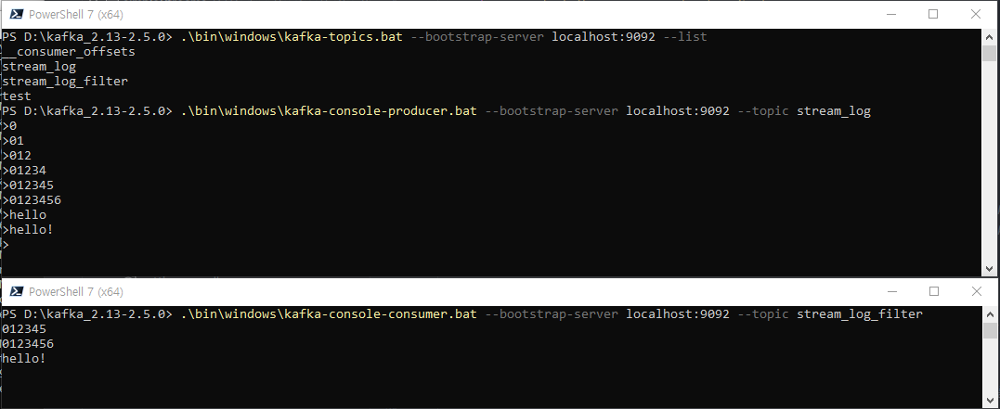

### ✅ SimpleStreamFilterApplication 실행 결과 확인


### ✅ KStreamJoinKTableApplication 실행 결과 확인
### ✅ KStreamJoinGlobalKTableApplication 실행 결과 확인
- KStream와 KTable join 시 파티션 개수 같아야함. join key 지정 필요 없음
- KStream과 GlobalKTable join 시 파티션 개수 같지 않아도 됨. join key 지정 필요
- GlobalKTable에 데이터가 많아질 경우 브로커에 부하가 발생할 수 있으므로
  - GlobalKTable을 사용할 지, KTable을 리파티셔닝 해서 새로운 토픽을 생성할지는 개발자가 결정!
```bash
$ .\bin\windows\kafka-console-consumer.bat --bootstrap-server localhost:9092 --topic order_join --property print.key=true --property key.separator=":" --from-beginning

# application 실행 후 
# order, address topic에 record 추가
wendy:iPhone send to Seoul
wonoo:Galaxy send to Busan

# 동일한 key값에 대하여 다른 address record 추가
# order record 추가 하면
# key값에 대한 최신값을 사용(KTable)한 join 수행
wendy:iPhone send to Jeju
```

#### 💝 참고 : intelliJ 의 kafka extension 사용하여 produce 쉽게 하기


### ✅ KStreamJoinGlobalKTableApplication 실행 결과 확인
```bash

```


